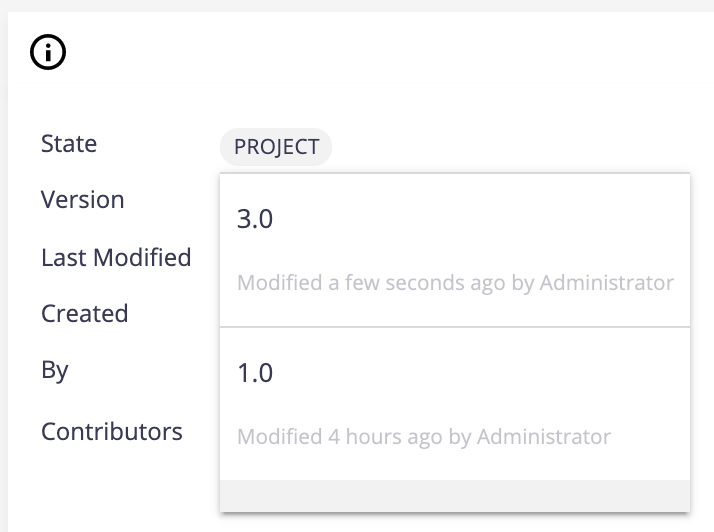

# Actions on Versioned Documents

## Description

This module helps you understand how to manipulate document versions:
- Update a version lifecycle status (like if v1 is validated, and then v2 the new validated version: we need to set v1 as obsolete).
- Delete document versions (like if you need for technical reasons to clean minor versions).

## Usage

Deploy and adapt the content of the provided sample of automation scripting depending on your needs.

## Installation

:information_source: This is the installation step to update a document version lifecycle state.

### Studio Modeler

- In **Nuxeo Studio Modeler > Automation > Automation Scripting**, Create an automation scripting with the content of `updateState.js`
  - Input type: `Document`
  - Output type: `Document`
  - Add a parameter called `versionToUpdate` in the "Parameters" tab
- Reuse the automation scripting from the automation chain (`Scripting > javascript.updateState`), filling the `versionToUpdate` with a specific number, which can be a context variable.
- Trigger your automation chain from a button or an event.

## Configuration

- You can substitute the `Document.FollowLifecycleTransition` operation by a `Document.Delete` operation. Feel free to add new parameter, like `cleanVersions` parameter, which could for example identify the versions which should be cleans (like `minor`, `major`, `onlyKeepLatest`...)

## Documentation Links

- [HOWTO: Write Reusable Automation Chains](https://doc.nuxeo.com/nxdoc/how-to-write-reusable-automation-chains/)
- [Nuxeo Automation Scripting](https://doc.nuxeo.com/nxdoc/automation-scripting/)

## Issues and Limitations

In Nuxeo, versions are an "archive" of the past and are therefore by immutable, otherwise history cannot be guaranteed. But because there are technical processes (fulltext indexing, trash, lifecycle management) that requires to "technically" write them, the Java code has escape hatches to allow version write (`CoreSession.ALLOW_VERSION_WRITE` passed in context data before saveDocument). But this is only accessible from custom Java code.

If you need to write to versions, either choose something that can be changed (the lifecycle state is one, `dc:issued` another), or write a custom operation in Java to use `ALLOW_VERSION_WRITE`.

Your use case above seems to match pretty well with a lifecycle state.

We haven't made the list of properties that can be written on a version pluggable, because there has never been a real use case
