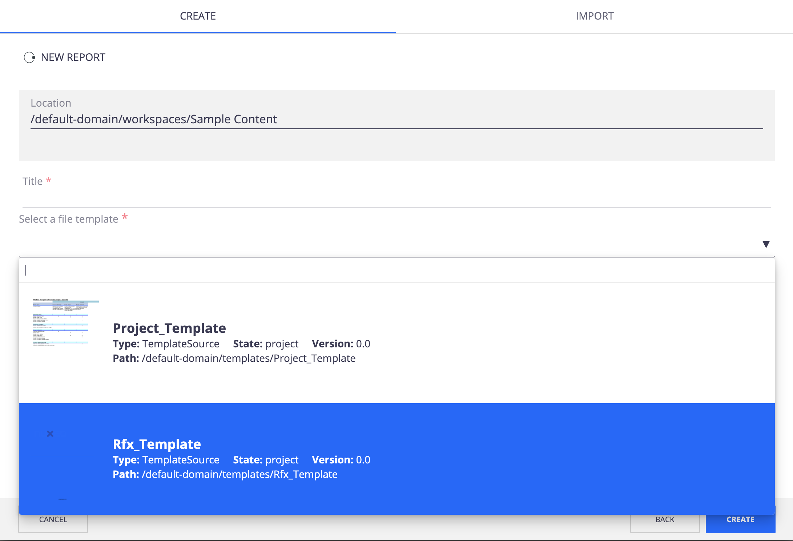

# Create a new document from a template list



## Prerequisite

- Nuxeo Web UI and Nuxeo Template Rendering addons
- Create a template document under **Root** > **Templates** path with a nice description. The document type should be `TemplateSource`.

## Description

This module allows you to automaticcaly create the file content from a template file selection. This behavior is often requested in document management platform, when specific templates are available for users (usually Office Documents) to use the right corporate validated template, and not to start from an empty document.

## Usage

- Add the `nuxeo-file-template-select-element` element in the document type create layout.
- Integrate the following in the `create` and/ or `import` layout of your document type.

## Installation

### Studio Modeler

- Add a property to store the ID (like `templateID` of type `String`) of the document template which should be used. You can use an external schema an attach it to your document type (to make it reusable across several document types), or directly create it on the document type schema screen.
- Create Automation Chain called `AC_SearchTemplates` with the following content:

```
- Repository.Query:
    language: NXQL
    query: "SELECT * FROM Document WHERE ecm:mixinType != 'HiddenInNavigation'AND ecm:isVersion = 0 AND ecm:isTrashed = 0 AND ecm:primaryType = 'TemplateSource'"
    sortOrder: ASC
```

- Create an automation script : `AS_CreateFromTemplate` and adapt Line 10 to the property storing the document template id.
- Create an Event handler to fire `AS_CreateFromTemplate` for your custom document type on the `Document created event`.

### Studio Designer

- Create the `nuxeo-file-template-select-element` element in the `UI` Resources
  - Adapt the `value` of the `nuxeo-document-suggestion` element to use the property storing the document template id
- Reference the element in your custom bundle file (`<link rel="import" href="<PATH>/nuxeo-file-template-select-element.html">`)
- Use the element on the create layout of your custom document type
  - You can safely remove the element linked to the `file:content` property, with the following syntax: `<nuxeo-file-template-select-element document="[[document]]"></nuxeo-file-template-select-element>`.
  - Don't forget to import the `nuxeo-file-template-select-element` element it on the create layout.
  - The element is using a i18n key: you can use the translations provided or directly hardcode the label in your selection element.
