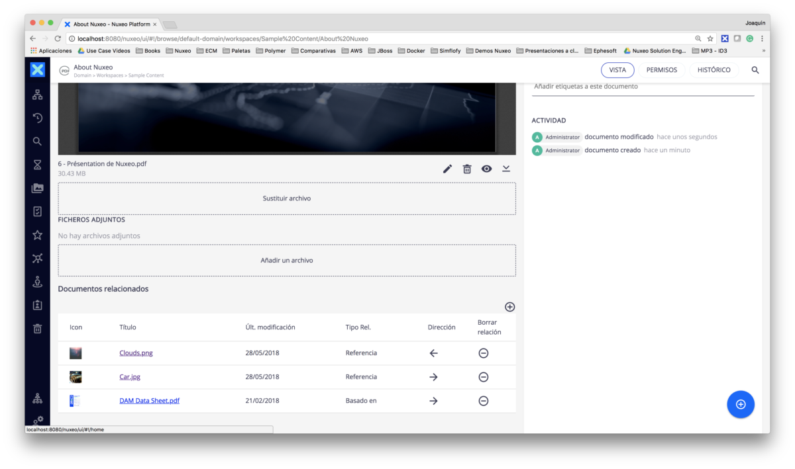

# Related Documents

## Prerequisites

- Nuxeo Web UI

## Description

This modules includes elements to list, add and remove document relations. It handles:
- Outgoing and Incoming relations
- Relations Type

## Usage

Integrate `<nuxeo-se-document-relations document="[[document]]"></nuxeo-se-document-relations>` element in the `view` layout of your document type.

## Installation

### Studio Modeler

- Create in the following automation scripting
  - `getAllRelations.js` as `getAllRelations`

### Studio Designer

- Create a `related-documents` folder under the `UI` folder
- Import `nuxeo-se-add-relation-dialog.html`, `nuxeo-se-document-relations.html`, `nuxeo-se-remove-relation-button.html` in the `related-documents` folder.
- Add the references in `nuxeo-[project-name]-custom-bundle.html` :
    `<link rel="import" href="related-documents/nuxeo-se-add-relation-dialog.html">`
    `<link rel="import" href="related-documents/nuxeo-se-document-relations.html">`
    `<link rel="import" href="related-documents/nuxeo-se-remove-relation-button.html">`
- Create a new default translation file (`messages.json`), and add the entries of `/designer/mesages.json` without including the `{}`

## Documentation Links

- [Managing Vocabularies](https://doc.nuxeo.com/nxdoc/managing-vocabularies/)
- [HOWTO: Create and Reuse a Custom Element](https://doc.nuxeo.com/nxdoc/how-to-create-and-reuse-custom-element/)
- [Web UI Layout Elements](https://doc.nuxeo.com/nxdoc/web-ui-layouts/)
